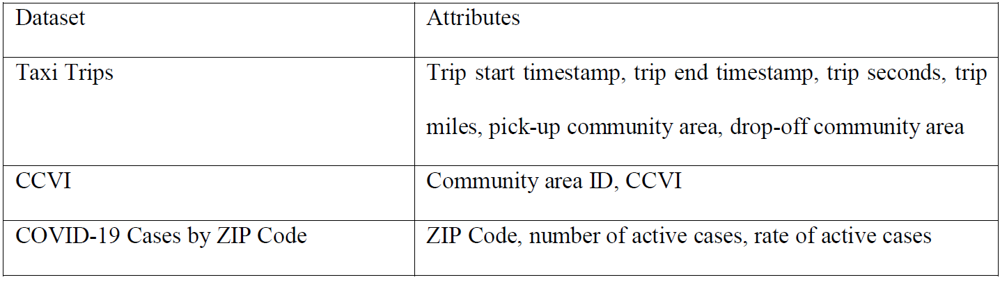
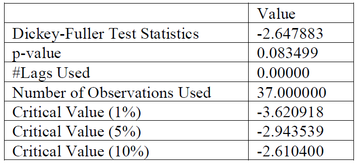
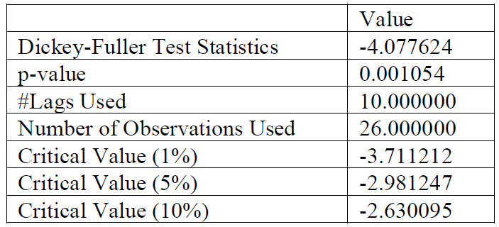
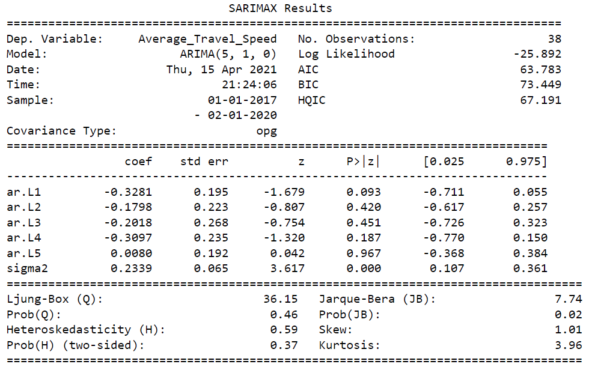
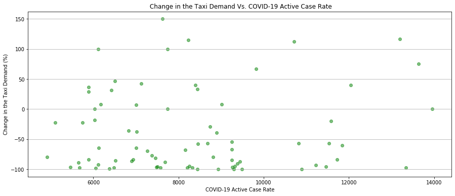
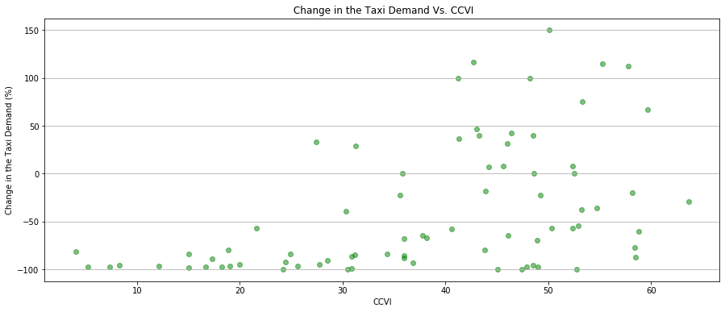
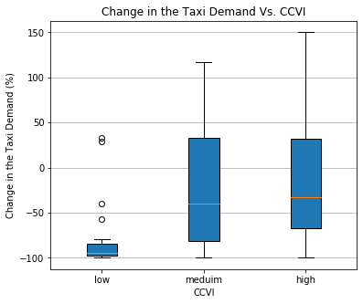

# Intervention Analysis: Assessing the Impact of the COVID-19 Pandemic on Taxi Travel in Chicago
## Overview 
Taxi cabs in urban areas have been heavily affected by the COVID-19 pandemic. In this study, we investigate the impact of the COVID-19 pandemic on some important metrics namely average travel speed of taxis and demand for taxi cabs in Chicago, US. For this purpose, we employ Intervention Analysis with the data from some publicly available datasets including Chicago Taxi Trips. we also visualize the relationship between some COVID-19 related variables and change in demand for taxi cabs before and after pandemic in different urban districts. The results show that COVID-19 has a significant impact on the average travel speed of taxis and demand for taxi cabs. 
## Introduction
COVID-19 pandemic has affected our lives in different ways. Specifically, due to the severe enacted restrictions, urban transportation has experienced a significant impact by the pandemic. Lockdown regulations have limited the mobility of citizens and health considerations have changed the transportation-related behavior of the public. Therefore, it is of great importance for transportation planners and decision-makers to identify the changes in transportation metrics caused by the pandemic to make proper decisions based on the new situation. It has also attracted scholars to investigate the impact of COVID-19 on transportation. By analyzing the travel records in Mainland, China, Huang et al. indicated the significant impact of COVID-19 on urban travels [1]. Arellana et al. studied the impact of the COVID-19 pandemic on air transport, freight transport, and urban transport. They showed that demand for motorized trips across the cities has decreased on local and nationwide scales [2]. The pandemic has also influenced the travel mode choice. Duby et al. indicated that people have been using public transport less frequently during the COVID-19 pandemic compared to a normal period as they find it difficult to observe the social distancing on public transports [3]. 

Taxi cabs as a major transport system in urban areas have been heavily affected by the COVID-19 pandemic [4]. The availability of data in some capital cities in the world enables us to investigate the impact of the pandemic on different metrics of taxi services such as demand and travel times in urban areas. It is also important to study the relationship between the transportation metrics and different COVID-19 related variables including active case rate, phase of recovery, etc.

In this study, first, we aim to investigate the impact of the COVID-19 pandemic on some important metrics namely average speed and taxi cab demand. To this purpose, we accomplish an Intervention Analysis on the time series (also known as Interrupted Time Series Analysis) derived from the historical data. By employing Intervention Analysis, we try to investigate whether the appearance of a condition or policy (i.e., COVID-19 and its related regulations and policies) has affected a variable (e.g., average travel speed of taxis) in time. Second, we try to see if there is a relationship between some COVID-19 related variables (i.e., active case rate and also COVID-19 Community Vulnerability Index (CCVI)) and change in demand for taxi cabs before and after pandemic in different urban districts (community areas in our case). 
## Questions
In this study we try to address the following questions:

1-	Has the demand for taxi cabs significantly changed after the start of the pandemic? 

2-	Has the pandemic impacted the travel time in Chicago? 

3-	Chicago has 77 community areas and each community area has a different active case rate and COVID-19 Community Vulnerability Index (CCVI). Is there a relationship between these variables and the change in the demand for taxi cabs? 

 

<figcaption align = "left"><b>Figure 1- COVID-19 case rate based on ZIP codes and community areas. As can be seen from the map, there is not a 1-by-1 relationship between these two datasets. </b></figcaption>

## Data
For this study, we use three datasets provided by Chicago Data Portal. The first dataset is the Taxi Trips dataset that contains the information of the taxi trips reported to the City of Chicago in its role as a regulatory agency. Although not all trips are reported, the City of Chicago believes the most are . The Taxi Trips dataset contains 195 million rows each row describing a single trip with 23 attributes. Table 1 shows the most important attributes of each trip. The second dataset contains the Chicago COVID-19 Community Vulnerability Index (CCVI) which contains the vulnerability of each community to COVID-19. Vulnerability is derived by combining sociodemographic factors, epidemiological factors, occupational factors, and cumulative COVID-19 burden [5]. The other dataset, COVID-19 Cases by ZIP Code, contains the active case rate in different parts of the city.

<figcaption align = "left"><b>Table 1- Important attributes of the datasets.</b></figcaption>

 

### Data API
Since the Taxi Trips dataset used in this study is large, downloading and working with this data on a local machine is not a convenient option for us. Accordingly, we decided to use the data API provided by the Chicago Data Portal which enables us to programmatically access the publicly available dataset. The data is accessible through Socrata Open Data API that supports web-based data queries and a couple of languages including Python, PowerShell, and jQuery. We use the Python package “Sodapy” along with SoQL (Socrata Query Language) to efficiently query the required data. Using SoQL enables us to transform the data to the desired format in the server machine and retrieves lightweight summary tables required in the downstream analysis.  
### Data Preparation
Data preparation generally includes gathering the data, data cleaning, and data transformation. We skip the first step (gathering the data) as data is gathered by the City of Chicago.
 In the data cleaning step, we remove the data with extraordinary large or small attribute values (e.g. travel time). We also discard the records for which the pick-up and drop-off attribute is null (this step is performed only if the mentioned location information is required in the analysis). 
To prepare the data for the analysis we also need to transform the original data to a proper format. For example, this step includes transforming the date/time attribute and combining different datasets to enriched tables. Moreover, we need to transform some spatial datasets using GIS applications (e.g. ArcMap) to assimilate the spatial units. In our case, the “COVID-19 cases by ZIP code” dataset provides the COVID-19 case rates for a set of points (coordinate of the ZIP codes) throughout the city, and on the other hand, the start and end location of taxi trips are declared based on community areas. Since there is not a 1-by-1 relationship between community areas and the COVID-19 dataset (presented by ZIP codes) (Figure 1), we need to transform the COVID-19 dataset to have the case rates in each community area (Figure 2). 

 

<figcaption align = "left"><b>Figure 2- Spatial data transformation. To have COVID-19 related variables and transportation variables in the same spatial units (i.e., community areas), the COVID-19 data is spatially transformed.  </b></figcaption>

## Analysis 
The first cases of COVID-19 in Chicago were tested positive in the early March 2020. Figure 3 shows the daily total number of trips in Chicago. By comparing the daily number of trips before and after the start of the pandemic it is crystal clear that the demand for taxi cabs has significantly decreased due to the pandemic. 

 

<figcaption align = "left"><b>Figure 3- Daily number of taxi trips in Chicago. </b></figcaption>

Figure 4 shows the daily number of COVID-19 cases and the daily number of trips after the start of the pandemic in the same chart. After the start of the pandemic, the number of taxi trips experiences the lowest value in its history. However, after a decrease in the number of COVID-19 cases in Jun 2020, the demand for taxi cabs started its ascending move. The total number of trips reaches its peak in October 2020 where the second wave of COVID-19 starts and again causes a decrease in the number of taxi trips in November and December 2020. As the number of active cases starts going down in January 2020, we witness a rise in the demand for taxi trips. An interesting observation is that even though the second wave of COVIS-19 was more severe than the first one, the demand for taxi cabs is higher during the second wave. This observation can be associated with alleviated concerns about the risk of using public transport, increased availability of personal protective equipment such as face masks, and new recovery phases. 

 

<figcaption align = "left"><b>Figure 4- Daily number of COVID-19 cases and daily number of trips.</b></figcaption>

### Impact of COVID-19 on average travel speed
Figure 5 indicates the weekly average taxi travel speed before and after the pandemic. One intuitive approach to finding the impact of COVID-19 on taxi travel speed is to compare the travel speed at some point before and after the pandemic. However, such a comparison is not a powerful approach to indicate or rule out the impact of a variable. As an example, the steadiness of a variable over time might be the result of an intervention however a simple comparison interprets it as a non-interrupted behavior. Simple speaking, using a point-to-point comparison, most of the information in a time series is not considered. Moreover, such variables have seasonal variations, and we need to somehow take these seasonal variations into account. 

 

<figcaption align = "left"><b>Figure 5- Weekly COVID-19 cases and average taxi travel speed.</b></figcaption>

We investigate the impact of the pandemic on the average travel speed by performing an Intervention Analysis. The basis of Intervention Analysis is time series analysis and prediction. The first step in Intervention Analysis is to predict future values of a variable (e.g., average travel speed) using the time series data before the pandemic and then we compare the predicted variable with the real values. We use an ARIMA time series model to predict the average taxi speed. Figure 6 shows the seasonal decomposition of the time series of average taxi speed before the pandemic using the ARIMA model. 

 

<figcaption align = "left"><b>Figure 6- Seasonal decomposition using ARIMA model.</b></figcaption>

#### Stationarity
An initial step time series modeling is to stationarizing the data. By stationarizing we aim to make sure that the mean and variance of the data are not a function of time. We also need to change the data in a way that the covariance of the i-th term and the (i + m) th term are not a function of time. To test the stationarity, we can simply look at the rolling mean and standard deviation chart (Figure 7) or use a statistical test like Dickey-Fuller test [6]. As we can see in Figure 7 the series does not seem to be stationary. This observation is also confirmed by the results of Dickey-Fuller test (Table 2). 

 

<figcaption align = "left"><b>Figure 7- Rolling mean and standard deviation of average taxi travel speed.</b></figcaption>

<figcaption align = "left"><b>Table 2 - Results of Dickey-Fuller test on the original time series.</b></figcaption>

 

We take the first difference of time series data to make it stationary and repeat the Dickey-Fuller test. The results of the test after taking the test difference imply the stationarity of the results (p-value = 0.001054).

<figcaption align = "left"><b>Table 3 - Results of Dickey-Fuller test after taking the first difference.</b></figcaption>

 

 
#### Building the model and prediction
We use ACF and PACF charts to find the optimal parameters for the seasonal ARIMA model [7] and build the ARIMA model. Table 4 shows the summary of the built model. 

<figcaption align = "left"><b>Table 4-summary result of built seasonal ARIMA model.</b></figcaption>

 

The average travel speed is predicted for the period after the start of the pandemic (after March 2020). Figure 8 shows the predicted and observed average travel speed in the same chart. As can be seen in the chart it seems that there is a significant difference between the observed and predicted values which we infer it as the impact of COVID-19 on the average travel speed of taxi cabs in Chicago. We also statistically test if these two sets of values (observed and predicted time series) are significantly different. There are many statistical tests for this purpose, but we use a t-test for simplicity. The calculated p-value of the t-test is (4.129560687737479e-05) which suggests a significant difference between the prediction and observed values. 

 

<figcaption align = "left"><b>Figure 8- Predicted and observed average travel speed.</b></figcaption>

### Relationship between COVID-19 active case rate and CCVI in community areas and change in demand for taxi cabs
We try to examine if there is a relationship between two COVID-19 related variables namely COVID-19 active case rate and also COVID-19 Community Vulnerability Index (CCVI)) and change in demand for taxi cabs before and after pandemic in different urban districts (community areas in our case). COVID-19 active case rate in each area is calculated by dividing the number of active cases by the population. Figure 9 shows a scatter plot of data points (as there are 77 community areas in Chicago (Figure 1)) that represent the percentage of change in taxi demand before and after the pandemic based on the COVID-19 active case rate in each community area. This visual does not suggest a relationship between these two variables. Figure 10 on the other hand suggests a pattern between the percentage of change in taxi demand before and after the pandemic and the COVID-19 Community Vulnerability Index (CCVI). CCVI represents the vulnerability of each community to COVID-19and is calculated by combining sociodemographic factors, epidemiological factors, occupational factors, and cumulative COVID-19 burden [5]. This relationship can also be seen in Figure 11which represents similar data but this time the CCVI is represented by a nominal variable (low, medium, high) that is used by the Department of Public Health in United Stated. We do not intend to statistically test the presence of a relationship between these variables at this point, however, we find these findings a good starting point for future research. 

 

<figcaption align = "left"><b>Figure 9- Change in the Taxi Demand before and after pandemic Vs. COVID-19 Active Case Rate.</b></figcaption>

 

<figcaption align = "left"><b>Figure 10- Change in the Taxi Demand before and after pandemic Vs. CCVI.</b></figcaption>

 

<figcaption align = "left"><b>Figure 11- Change in the Taxi Demand before and after pandemic Vs. CCVI.</b></figcaption>

## Conclusions 
This study investigated some potential impacts of the COVID-19 pandemic on taxi travel in Chicago, US. We showed that the demand for taxi cabs has significantly dropped after the start of the pandemic. By using an intervention analysis, we also showed that the pandemic has interrupted the average travel speed of taxi cabs. The average travel speed has meaningfully increased after the start of the pandemic; specifically, if we compare the observations with the scenario in which the COVID-19 pandemic had not happened. We also showed that there is potentially a relationship between the change in the taxi demand before and after the pandemic and CCVI. We suggest that future studies elaborate on the relationship between these two variables. 

  ### References
  [1] Huang, J., Wang, H., Fan, M., Zhuo, A., Sun, Y., & Li, Y. (2020, August). Understanding the impact of the COVID-19 pandemic on transportation-related behaviors with human mobility data. In Proceedings of the 26th ACM SIGKDD International Conference on Knowledge Discovery & Data Mining (pp. 3443-3450).
  
  [2] Arellana, J., Márquez, L., & Cantillo, V. (2020). COVID-19 outbreak in Colombia: an analysis of its impacts on transport systems. Journal of Advanced Transportation, 2020.
  
  [3] Wilbur, M., Ayman, A., Ouyang, A., Poon, V., Kabir, R., Vadali, A., ... & Dubey, A. (2020). Impact of COVID-19 on Public Transit Accessibility and Ridership. arXiv preprint arXiv:2008.02413.
  
  [4] Nian, G., Peng, B., Sun, D. J., Ma, W., Peng, B., & Huang, T. (2020). Impact of COVID-19 on Urban Mobility during Post-Epidemic Period in Megacities: From the Perspectives of Taxi Travel and Social Vitality. Sustainability, 12(19), 7954.
  
 [5] Online at: https://data.cityofchicago.org/Health-Human-Services/Chicago-COVID-19-Community-Vulnerability-Index-CCV/xhc6-88s9
 
  [6] Cheung, Y. W., & Lai, K. S. (1995). Lag order and critical values of the augmented Dickey–Fuller test. Journal of Business & Economic Statistics, 13(3), 277-280.
  
  [7] Adhikari, R., & Agrawal, R. K. (2013). An introductory study on time series modeling and forecasting. arXiv preprint arXiv:1302.6613.
